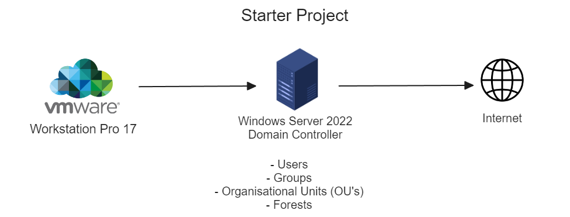
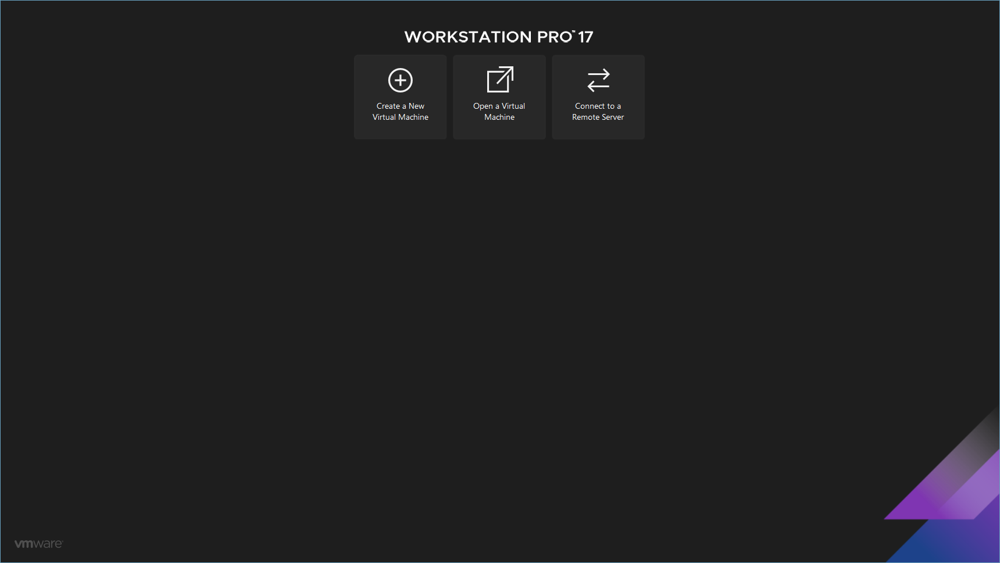
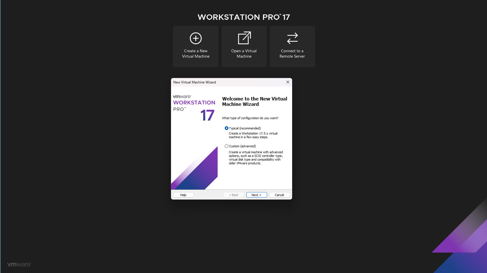
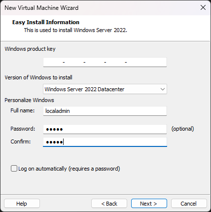
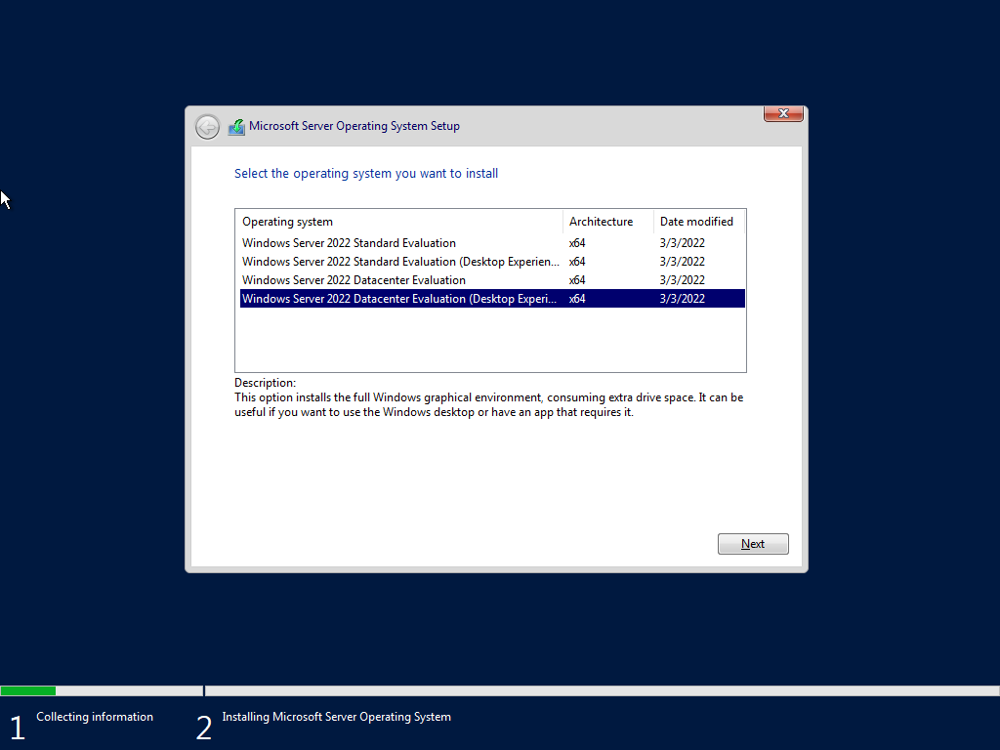
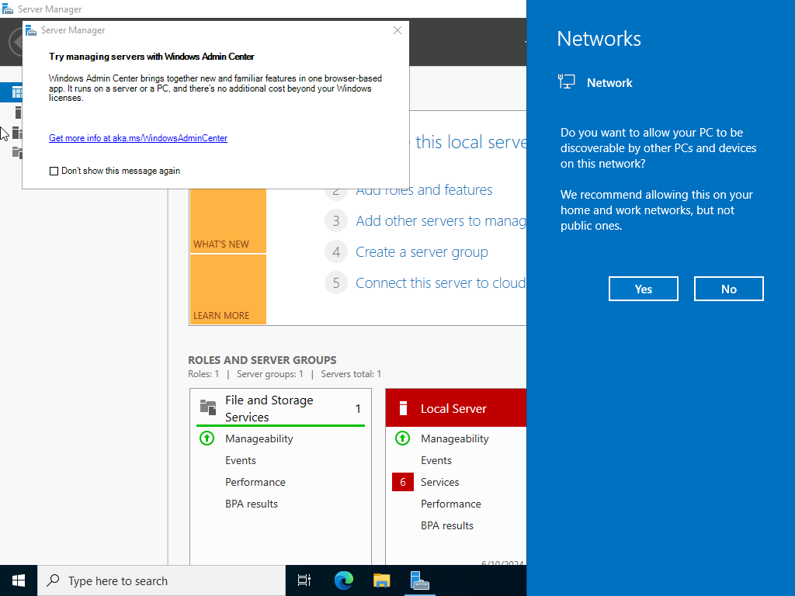
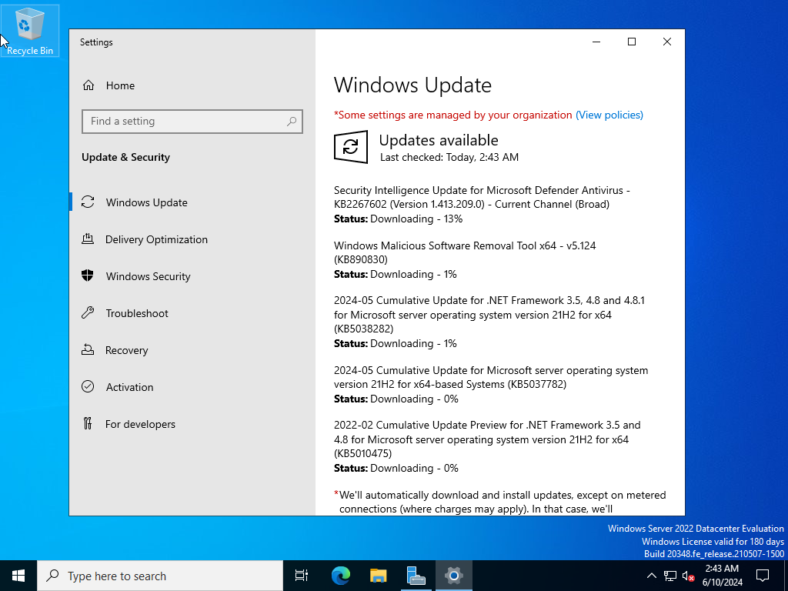

# Active Directory Home Lab

An Active Directory Domain Services (AD DS) environment inside of VMware Workstation Pro 17.
This project starts with a Windows Server 2022 VM in which things such as basic Users, Groups, and Organisational Units (OU) are configured.

The completed project then moves on to set up a client machine and uses PowerShell scripting to configure over 1000 users.

## Architecture

### Starter

The starter project runs inside VMware Workstation Pro 17. This was recently made available to be downloaded and used for [free for personal use](https://blogs.vmware.com/workstation/2024/05/vmware-workstation-pro-now-available-free-for-personal-use.html).

Windows Server 2022 is run as a virtual machine within VMware and will also be configured to have a network connection.

Starter is a WIP.

### Complete

Complete is a WIP.

## Initial VMware Setup

### Prerequisites

This project uses VMware Worksation. More information can be found [here](https://www.vmware.com/products/workstation-pro/html.html).

The Windows Server 2022 ISO file can be downloaded from [here](https://www.microsoft.com/en-us/evalcenter/download-windows-server-2022).

### Configuring the Virtual Machine

Load VMware and select `Create New Virtual Machine`.

Select the default (typical) from the setup wizard.

Once the `.ISO` file has been selected, a prompt will ask for a product key. A product key can be ommited to make use of the 180 day trial.

Keep the version as Datacenter to install the data centre version of Windows Server 2022.

Accept and create a local administrator account.

Continue to follow the prompts on the screen and make sure to select the Datacenter Evaluation (Desktop Experience) to install a desktop environment.

Follow the remaining prompts and restart the system once the install has finished to reach the desktop. Accept the network connection so the VM can access the internet.

After the initial boot, it is good practice to fully update the system to receive the latest features and security patches. Once installed, restart and the system should be ready.

From here, create a VMware snapshot to revert back to if any errors are made.

## Starter Project

### Active Directory Basics

Here I will complete some basic actions in Active Directory.

## Known Issues

- Issue with Windows Server 2022 displaying desktop properly at 1920x1080 resolution inside of VMware Workstation.

## Additional Resources

- Microsoft's training platform [Learn](https://learn.microsoft.com/en-us/training/) has a module focused on [AD DS](https://learn.microsoft.com/en-us/training/).

- Jon Good [Windows Server with VMware](https://youtu.be/II-a79HFQtQ?si=WNRtZwhiH6w9uKkJ)
