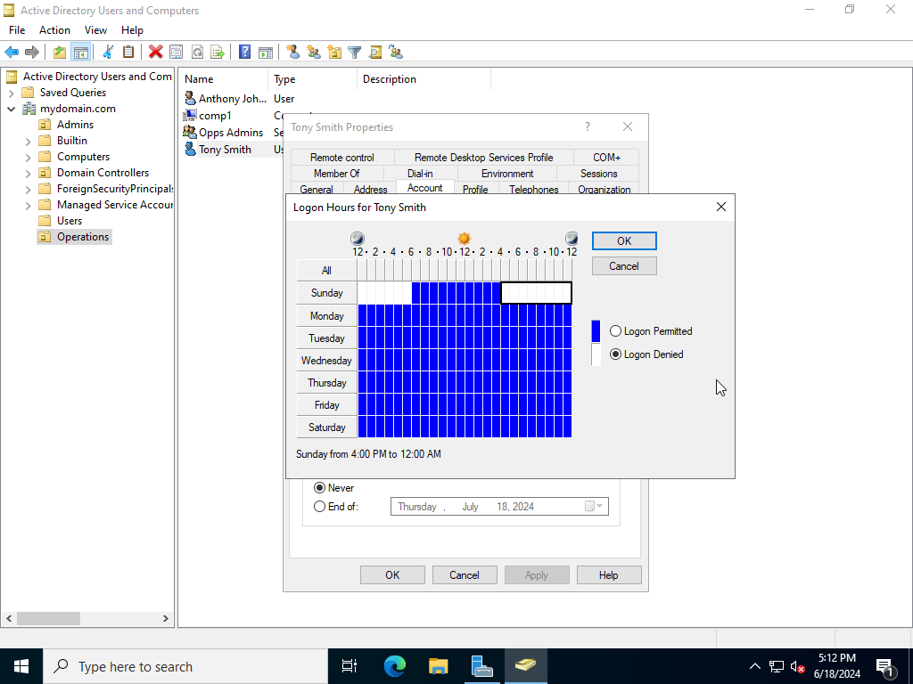

# Active Directory Home Lab

This is a project configuring an Active Directory Domain Services (AD DS) environment inside of VMware Workstation Pro 17.

This project starts with a Windows Server 2022 VM with AD DS installed in which things such as basic Users, Groups, and Organisational Units (OU) are configured.

## Architecture

The project runs inside VMware Workstation Pro 17. This was recently made available to be downloaded and used for [free for personal use](https://blogs.vmware.com/workstation/2024/05/vmware-workstation-pro-now-available-free-for-personal-use.html).

Windows Server 2022 is the virtual machine of choice and will also be configured to have a network connection. I understand the process will be similar for older versions of Windows Server.

## Initial VMware Setup

### Prerequisites

VMware Worksation, Oracle Virtualbox or Windows Hyper-V can be used to create VM's for Windows users. There are other options for Linux based users. More information can be found [here](https://www.vmware.com/products/workstation-pro/html.html) on WMware.

The Windows Server 2022 ISO file can be downloaded [here](https://www.microsoft.com/en-us/evalcenter/download-windows-server-2022).

### Configuring the Virtual Machine

This project is completed with VMware. Refer to the chosen hypervisor documentation for software other than VMware.

Load VMware and select `Create New Virtual Machine`.

Select the default (typical) from the setup wizard.

Once the `.ISO` file has been selected, a prompt will ask for a product key. A product key can be ommited to make use of the 180 day trial.

Keep the version as Datacenter to install the data centre version of Windows Server 2022.

Accept and create a local administrator account.

Continue to follow the prompts on the screen and make sure to select the Datacenter Evaluation (Desktop Experience) to install a desktop environment.

Follow the remaining prompts and restart the system once the install has finished to boot to the desktop. Accept the network connection so the VM can access the internet.

After the initial boot, it is good practice to fully update the system to receive the latest features and security patches. Once installed, restart.

From here, create a snapshot to revert to incase of any future errors.

### Changing the Network Interface Card Name

This will be helpful in the future if the project is expanded to identify different NIC's.

Select the `Network Internet Access` from the dashboard on the bottom right hand side of the Windows Taskbar and enter the `Network and Internet Settings` menu.

Select `Change Adapter Options` to view all NIC's.

On the Ethernet NIC, `Right Click > Rename` and name it something easy to identify.

## The Project

### Installing Active Directory Domain Services

From the Server Manager Dashboard, select `Add roles and features` to install AD DS.

Select `Role-based or feature-based installation > Select a server from the server pool (and select the PC currently in use)` and ensure the checkbox for `Active Directory Domain Services` is selected.

Continue to accept the defaults and complete the installation. Successful installation is pictured below.

### Domain Controller and AD Forest Configuration

From here, the server needs to be promoted to a domain controller. Open the notification flag in the top right hand side of the toolbar and select `Promote this server to a domain controller`.

From here a new `Forest` can be created. A `Forest` is the top-level container that holds one or more AD domains. A root domain name should be specified. Sub-domains can be configured later.

After a reboot, the login screen should display a prompt for the newly created domain.

### Configuring Organisational Units, Users and Groups

#### Organisational Units

Open the AD DS Menu from the Server Manager Dashboard by navigating to `Tools > Active Directory Users and Computers`.

Next, an Organisational Unit (OU) can be created by right clicking on the domain and selecting `New > Organisational Unit`. For this project we have created an `Operations` OU.

#### New Users

A user can be configured by right clicking in the blank space inside the OU and select `New > User`. Once the users information has been input, select `OK` to create the user.

#### New Groups

A new group can be created by right clicking inside the OU and selecting `New > Group`. For this project, I have configured an admin group for the Operations OU.

The users are selected and added to the group, by right clicking and selecting `Add to a group`.

Input the group name inside the `Enter the object names to select` text box and select the `Check Names` button confirm the correct name. Select `OK` to accept.

#### Other configuations

There are many different configurations that can be made through the AD DS Identity Provider. Objects such as computers can be configued through the same means.

An interesting configuration is the configuration of log on times for specific users.

## Known Issues

- Issue with Windows Server 2022 displaying desktop properly at 1920x1080 resolution inside of VMware Workstation.

## Additional Resources

- Microsoft's training platform [Learn](https://learn.microsoft.com/en-us/training/) has a module focused on [AD DS](https://learn.microsoft.com/en-us/training/).

- Jon Good's [Windows Server with VMware](https://youtu.be/II-a79HFQtQ?si=WNRtZwhiH6w9uKkJ) YouTube training.

## Future Changes

I will continue to explore Active Directory through online training providers to ensure my skills are up to date and any gaps in my knowledge have been covered.
